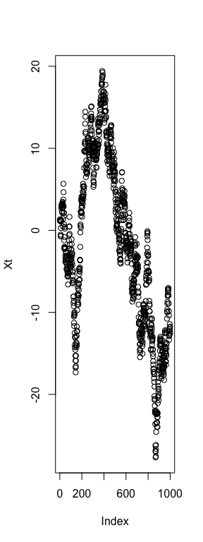
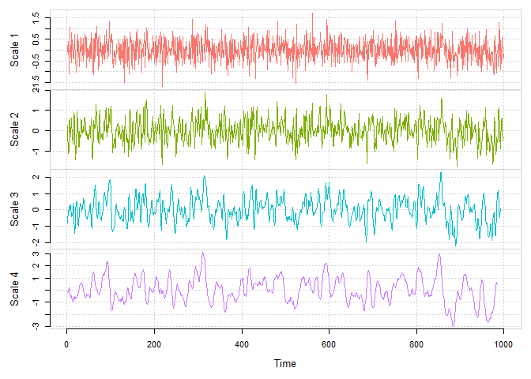

<!-- README.md is generated from README.Rmd. Please edit that file -->
[](https://travis-ci.org/SMAC-Group/wv)

`wv` R Package 
===============================================================

This repository holds the Wavelet Variance (wv) R package. This estimation technique computes the classical and robust wavelet variance for time series and regular lattices.

Below are examples of the capabilities of the `wv` package.

Install Instructions
--------------------

To install the `gmwm` package, there is currently one option: GitHub (Developmental).

### Recommended R Interface

We firmly recommend that any users of this package use the [RStudio IDE](https://www.rstudio.com/products/rstudio/download/) over the default R GUI.

**All Systems**

With the system dependency taken care of, we continue on by installing the R specific package dependencies and finally the package itself by doing the following in an R session:

``` r
# Install dependencies
install.packages(c("RcppArmadillo","ggplot2","reshape2","devtools","knitr","rmarkdown"))

# Install the package from GitHub without Vignettes/User Guides
devtools::install_github("SMAC-Group/wv")
```

Discrete Wavelet Transformation
-------------------------------

For the moment this method will only work with Haar wavelets.

``` r
# Simulate a Gaussian random walk
n = 10^3
Xt = cumsum(rnorm(n))

# DWT
Xt.dwt = dwt(Xt)
#> Warning in dwt(Xt): The data has been truncated so that it is divisible by
#> `nlevels` (e.g. 2^*)

# Summary of Discrete Wavelet Coefficients 
summary(Xt.dwt)
#> 
#> Results of DWT using haar filter with 8 levels:
#> Displaying only the first 6 coefficients...
#> Level 1 Wavelet Coefficients
#>  -0.1084746 0.5944507 -1.586638 -0.0840833 -0.2076718 1.1388 ...
#> Level 2 Wavelet Coefficients
#>  0.4472993 0.9299849 -0.5161243 -1.299101 1.300061 -1.669051 ...
#> Level 3 Wavelet Coefficients
#>  -2.253181 0.1867356 -3.286026 -2.430658 0.5681627 0.269031 ...
#> Level 4 Wavelet Coefficients
#>  -0.5586405 -2.089336 2.399998 -1.269859 1.806306 4.082554 ...
#> Level 5 Wavelet Coefficients
#>  -5.015596 -2.523779 2.235241 -6.879763 -5.731338 9.112186 ...
#> Level 6 Wavelet Coefficients
#>  -7.969766 18.20382 10.58148 5.149725 9.433671 -9.133821 ...
#> Level 7 Wavelet Coefficients
#>  17.02389 18.79904 45.77274 45.1232 ...
#> Level 8 Wavelet Coefficients
#>  12.64459 33.6311 ...

# Plot of Discrete Wavelet Coefficients
plot(Xt.dwt)
```



Maximum Overlap Discrete Wavelet Transformation
-----------------------------------------------

``` r
# MODWT
Xt.modwt = modwt(Xt)

# Summary of Maximum Overlap Discrete Wavelet Coefficients 
summary(Xt.modwt)
#> 
#> Results of MODWT using haar filter with 9 levels:
#> Displaying only the first 6 coefficients...
#> Level 1 Wavelet Coefficients
#>  -0.07670314 0.05183117 0.4203401 -0.7901498 -1.121922 1.055682 ...
#> Level 2 Wavelet Coefficients
#>  0.2236497 0.05118078 -1.140941 -0.9891564 0.4649924 0.5810474 ...
#> Level 3 Wavelet Coefficients
#>  -0.7966198 -0.6730423 -0.04439093 -0.07743897 0.2256393 0.2737334 ...
#> Level 4 Wavelet Coefficients
#>  -0.1396601 -0.2073275 -0.1560756 0.108662 0.1749601 0.04368706 ...
#> Level 5 Wavelet Coefficients
#>  -0.8866405 -0.9026779 -0.9804865 -1.095709 -1.151542 -1.197168 ...
#> Level 6 Wavelet Coefficients
#>  -0.9962208 -0.901971 -0.8566541 -0.8219462 -0.7432428 -0.670177 ...
#> Level 7 Wavelet Coefficients
#>  1.504713 1.575661 1.643968 1.706886 1.77265 1.767331 ...
#> Level 8 Wavelet Coefficients
#>  0.7902867 0.7922615 0.8014832 0.8151793 0.8241407 0.8514796 ...
#> Level 9 Wavelet Coefficients
#>  4.514588 4.539382 4.569616 4.593442 4.615863 4.635988 ...

# Plot of Maximum Overlap Discrete Wavelet Coefficients
plot(Xt.modwt)
```



User Guides
===========

Various guides ship with package or are available on <http://smac-group.com/> to provide insight into how to use the different methods. At the present time, the following vignettes are available:

1.  Process to Haar Wavelet Variance [(Online)](https://smac-group.com/computing/2016/05/23/process-to-haar-wavelet-variance-formulae.html)
