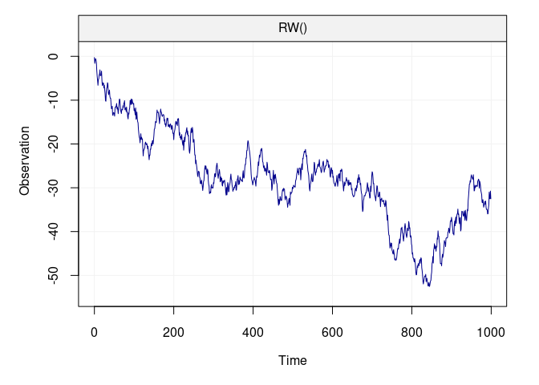
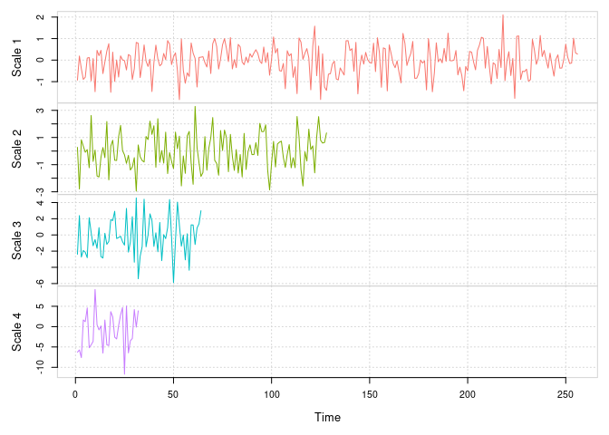
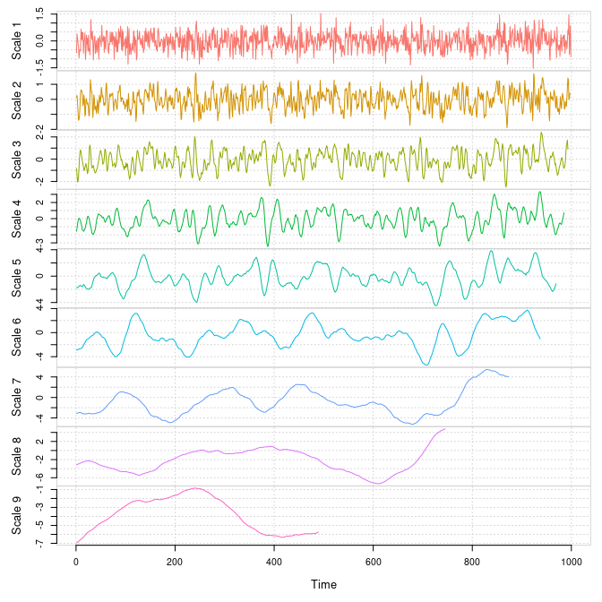
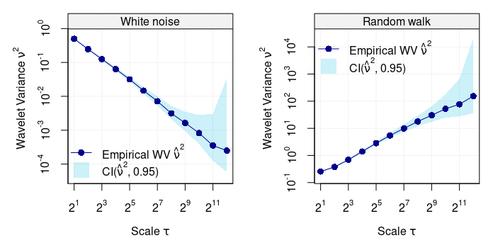
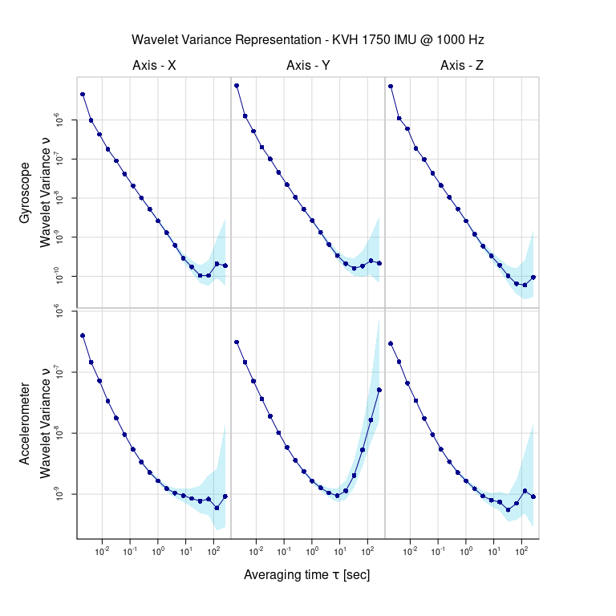

<!-- README.md is generated from README.Rmd. Please edit that file -->

[](https://travis-ci.org/SMAC-Group/wv)
[](https://opensource.org/licenses/AGPL-3.0)
[](https://cran.r-project.org/)
[](https://cran.r-project.org/package=wv)
[](http://www.r-pkg.org/pkg/wv)
[](http://www.r-pkg.org/pkg/wv)
[](https://github.com/SMAC-Group/wv)

# `wv` Overview <a href="https://smac-group.com/"></a>

This repository is dedicated to the Wavelet Variance (`wv`) R package
where different tools to perform wavelet variance analysis are provided
(both standard and robust analysis). Below are instructions and examples
on how to install and make use of the `wv` package.

*Currently the only implemented wavelet filter in the package is the
Haar wavelet filter.*

## Install Instructions

The `wv` package is available on both CRAN and GitHub. The CRAN version
is considered stable while the GitHub version is subject to
modifications/updates which may lead to installation problems or broken
functions. You can install the stable version of the `wv` package with:

``` r
install.packages("wv")
```

For users who are interested in having the latest developments, the
[GitHub](https://github.com/SMAC-Group/wv) version is ideal although
more dependencies are required to run a stable version of the package.
Most importantly, users **must** have a (C++) compiler installed on
their machine that is compatible with R (e.g. Clang). Once you’ve made
sure that you have a compatible C++ compiler installed on your computer,
run the following code in an R session and you will be ready to use the
devlopment version of `wv`.

``` r
# Install dependencies
install.packages(c("devtools"))

# Install/Update the package from GitHub
devtools::install_github("SMAC-Group/wv")

# Install the package with Vignettes/User Guides 
devtools::install_github("SMAC-Group/wv", build_vignettes = TRUE)
```

## Wavelet Variance Analysis

Below are some examples of how to make use of some of the main functions
in the `wv` package. Firstly, we highlight the functions that perform
the wavelet decomposition of a time series (both the discrete and
maximum-overlap discrete wavelet transforms) based on which the
following functions can compute the wavelet variance and its
corresponding confidence intervals for inference. These are particularly
useful, for example, when comparing the wavelet variance of different
time series in order to understand if they share common properties or
not.

### Discrete Wavelet Transform (DWT)

The DWT performs a wavelet decomposition by applying the wavelet filter
to non-overlapping windows of the time series. Below is an example of
how to perform this decomposition on a simulated Gaussian random walk
process.

``` r
# Load packages
library(wv)
library(simts)

# Set seed for reproducibility 
set.seed(999)

# Simulate a Gaussian random walk
n = 10^3
model = RW(gamma2 = 1)
Xt = gen_gts(n = n, model = model)

# Plot the simulated random walk
plot(Xt)
```

<!-- -->

Based on the above code, we have simulated a random walk with null
expectation unit innovation variance. The functions to compute the DWT,
access its output and plot the related wavelet coefficients can be found
below.

<!-- For the moment this method will only work with Haar wavelets.  -->

``` r
# DWT
Xt.dwt = dwt(Xt)
#> Warning in dwt(Xt): The data has been truncated so that it is divisible by
#> `nlevels` (e.g. 2^*)

# Print the Wavelet Coefficients 
summary(Xt.dwt)
#> 
#> Results of DWT using haar filter with 8 levels:
#> Displaying only the first 6 coefficients...
#> Level 1 Wavelet Coefficients
#>  -0.9281198 0.1909687 -0.4002392 -0.8957566 -0.7926733 0.09473632 ...
#> Level 2 Wavelet Coefficients
#>  0.2739394 -2.795066 0.8319477 0.3625764 -0.08550498 0.108777 ...
#> Level 3 Wavelet Coefficients
#>  -2.384147 2.388987 -2.733086 -1.928826 -2.133592 -2.809311 ...
#> Level 4 Wavelet Coefficients
#>  -6.282995 -5.729953 -7.616116 1.635971 1.2219 4.605007 ...
#> Level 5 Wavelet Coefficients
#>  -10.03819 -6.631445 -0.6948675 -19.01644 12.1667 -5.350667 ...
#> Level 6 Wavelet Coefficients
#>  -23.08426 -18.32217 18.40802 -8.680854 -4.335243 6.224648 ...
#> Level 7 Wavelet Coefficients
#>  -34.68146 -7.485961 -5.448519 -30.51181 ...
#> Level 8 Wavelet Coefficients
#>  -50.81154 1.13322 ...

# Plot of Discrete Wavelet Coefficients
plot(Xt.dwt)
```



### Maximum Overlap Discrete Wavelet Transformation (MODWT)

Compared to the DWT, the MODWT applies the wavelet filter to overlapping
windows of the time series (more specifically it slides the filter by
one observation at a time). As for the DWT, the functions to perform the
MODWT are below.

``` r
# MODWT
Xt.modwt = modwt(Xt)

# Summary of Maximum Overlap Discrete Wavelet Coefficients 
summary(Xt.modwt)
#> 
#> Results of MODWT using haar filter with 9 levels:
#> Displaying only the first 6 coefficients...
#> Level 1 Wavelet Coefficients
#>  -0.6562798 0.397592 0.1350352 -0.1386532 -0.2830119 -0.9393291 ...
#> Level 2 Wavelet Coefficients
#>  0.1369697 0.2645046 -0.2126415 -0.822003 -1.397533 -1.344998 ...
#> Level 3 Wavelet Coefficients
#>  -0.8429231 -1.362249 -2.044266 -1.991537 -1.571604 -0.827054 ...
#> Level 4 Wavelet Coefficients
#>  -1.570749 -1.175945 -0.7167598 -0.3172241 -0.04720348 0.01135659 ...
#> Level 5 Wavelet Coefficients
#>  -1.774519 -1.731545 -1.702113 -1.711879 -1.649612 -1.530804 ...
#> Level 6 Wavelet Coefficients
#>  -2.885532 -2.821419 -2.829503 -2.839451 -2.783538 -2.726905 ...
#> Level 7 Wavelet Coefficients
#>  -3.065437 -3.069304 -3.063743 -3.03344 -2.997907 -2.955661 ...
#> Level 8 Wavelet Coefficients
#>  -3.175721 -3.114701 -3.064177 -3.0097 -2.956361 -2.910441 ...
#> Level 9 Wavelet Coefficients
#>  -6.967706 -6.925613 -6.884283 -6.838645 -6.79024 -6.735489 ...

# Plot of Maximum Overlap Discrete Wavelet Coefficients
plot(Xt.modwt, index = "all")
```



### Wavelet Variance

If the interest of the user lies solely in the wavelet variance (issued
from either DWT or MODWT), then the package provides functions that
directly compute this quantity and deliver the tools necessary to
analyse it (confidence intervals and plots). Below is a code that
simulates a white noise and a random walk process and directly plots
their respective wavelet variances in a log-log plot applying the
`plot()` function to the package function `wvar()`.

``` r
# Set seed for reproducibility 
set.seed(999)

# Simulate Gaussian White noise
n = 10^4
Xt = gen_gts(n = n, model = WN(sigma2 = 1))

# Simulate Gaussian Random walk
Yt = gen_gts(n = n, model = RW(gamma2 = 1))

# Plot WV
par(mfrow = c(1,2), mar = c(4,5,1,1))
plot(wvar(Xt), main = "White noise")
plot(wvar(Yt), main = "Random walk", legend_position = NULL)
```



As indicated in the legends, the light shaded blue area represents the
95% confidence intervals for each scale of estimated wavelet variance.
However, there could be many practical settings where the time series
can suffer from some “contamination” (e.g. outliers) which can seriously
bias the standard estimator of wavelet variance. The code below randomly
replaces one percent of the observations from the above simulated random
walk with observations from a white noise process with larger variance.

``` r
# Add contamination
gamma = 0.01
Yt2 = Yt
Yt2[sample(1:n,round(gamma*n))] = rnorm(round(gamma*n),0,5)
par(mfrow = c(1,2), mar = c(4,5,1,1))
robust_eda(Yt, main = "RW without contamination")
robust_eda(Yt2, legend_position = NULL, main = "RW with contamination")
```


It can be seen how the classic and robust wavelet variance estimates
agree when there is no contamination (left plot) but they classic
estimates are heavily biased (especially at the first more informative
scales) when the random walk has only 1% contamination.

When dealing with different time series, it is possible to compare their
respective wavelet variances to understand if they have similar
behaviour/properties. An example is given below where four different
first-order autoregressive processes (with different values of the
autoregressive parameters) are simulated and succesively their wavelet
variance is computed.

``` r
# Simulate AR processes
n = 10^5
Xt = gen_gts(n = n, model = AR1(phi = 0.10, sigma2 = 1))
Yt = gen_gts(n = n, model = AR1(phi = 0.35, sigma2 = 1))
Zt = gen_gts(n = n, model = AR1(phi = 0.79, sigma2 = 1))
Wt = gen_gts(n = n, model = AR1(phi = 0.95, sigma2 = 1))

# Compute WV
wv_Xt = wvar(Xt)
wv_Yt = wvar(Yt)
wv_Zt = wvar(Zt)
wv_Wt = wvar(Wt)

# Plot results
compare_wvar(wv_Xt, wv_Yt, wv_Zt, wv_Wt)
```


As seen above, the function `compare_wvar()` allows to plot different
outputs of the `wvar()` function and it can be seen how the four time
series deliver different wavelet variances (as the autoregressive
parameter approaches zero, the shape of the wavelet variance plot
approaches the behaviour of the wavelet variance of a white noise
process).

### Wavelet Variance on IMU Data

In the package, we also add some datasets which are the wavelet variance
computed based on real IMU data. Currently the package includes datasets
`adis_wv`, `imar_wv`, `kvh1750_wv`, `ln200_wv` and `navchip_av`. We can
plot these wavelet variance simply with the `plot` function. As an
example:

``` r
data("kvh1750_wv")
plot(kvh1750_wv)
```



# User Guides

Various guides ship with package or are available on
<http://smac-group.com/> to provide insight into how to use the
different methods. At the present time, the following vignettes are
available:

1.  Process to Haar Wavelet Variance
    [(Online)](https://smac-group.com/computing/2016/05/23/process-to-haar-wavelet-variance-formulae.html)
